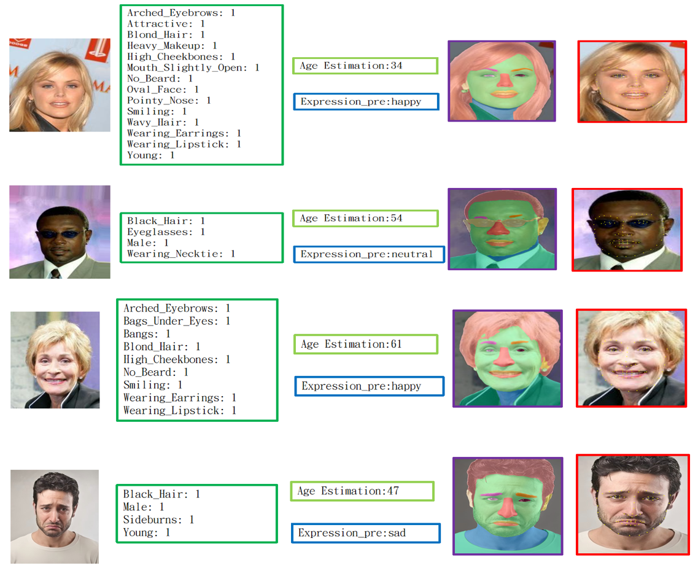

<div align="center">

# MOE-FaceUM: A Unified Face Perception Model with Face-aware Mixture of Experts


</div>
Recent advances in face perception tasks such as face recognition, emotion recognition, and age estimation have largely relied on task-specific models. Unified multi-task learning (MTL) frameworks based on Transformer backbones have emerged to leverage inter-task synergies through shared representations. However, different facial tasks often require task-specific features, which a single backbone struggles to fully capture. Inspired by the success of Mixture-of-Experts (MoE) architectures in large language models, we propose <i>MOE-FaceUM<i>, the first unified face analysis framework integrating MoE to simultaneously learn six facial tasks. Our model employs a Face-aware Router that dynamically directs inputs to task-relevant experts and emphasizes critical facial regions, enabling specialized feature extraction while maintaining efficiency. Comprehensive experiments on multiple benchmark datasets demonstrate the effectiveness of our approach. Notably, <i>MOE-FaceUM<i> improves binary facial attribute classification accuracy by approximately 4.4%, achieves lower normalized mean error (NME) in landmark localization, and maintains competitive performance in face parsing. For face recognition, especially on the challenging masked face dataset RMFD, our model enhancements outperforms the baseline by over 6%, showing enhanced robustness against intra-class variations and real-world noise.  </p>

# :rocket: News
- [07/31/2025] 🔥 We release <i>MOE-FaceUM</i> Inference Code.

## Installation
```bash
conda create --name MOE-FaceUM python=3.8
conda activate MOE-FaceUM

# Install requirements

pip install torch==2.0.1  torchvision==0.15.2 torchaudio==2.0.2

pip install -r requirements.txt

# Install MOE
cd model/parallel_linear
python setup.py install

# Install mmsegmentation
git clone https://github.com/open-mmlab/mmsegmentation.git
cd mmsegmentation
python setup.py install

# Install mmsegmentation
git clone https://github.com/open-mmlab/mmdetection.git
cd mmdetection
python setup.py install


```

## Download Models
The pretrained models can be downloaded manually from (https://github.com/FacePerceiver/FaRL/tree/main);

The model can be downloaded manually from [Google Drive](https://huggingface.co/kartiknarayan/facexformer)


The directory structure should finally be:

```
  . ── MOE-FaceUM ──┌── ckpts
                         ├── FaRL-Base-Patch16-LAIONFace20M-ep64.pth 
                         └── checkpoint.pth.tar 
                    ├── model
                    └── inference.py      
                    ├── results
                    └── images
```
## Usage


```python
CUDA_VISIBLE_DEVICES=0 torchrun --nproc_per_node=1 --master_port=53000  inference.py --config_path test.yaml \
                    --model_path ckpts/checkpoint.pth.tar \
                    --image_path images/2025073.jpg \
                    --results_path results \
                    --gpu_num 0 \

```

## Visualization

<p align="center" width="100%">
  
</p>

## TODOs
- Release training code.
- Release training script.

## Acknowledgement
We would like to thank the authors of [Faceptor](https://github.com/lxq1000/Faceptor) and [FaRL](https://github.com/FacePerceiver/FaRL) for their open-source contribution, which inspired parts of this project.
